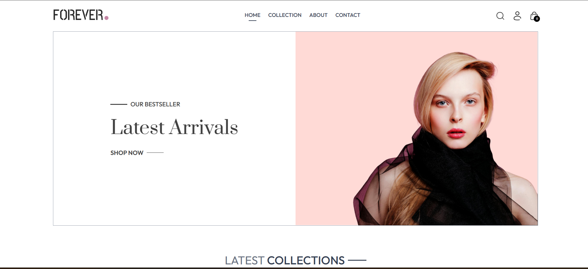
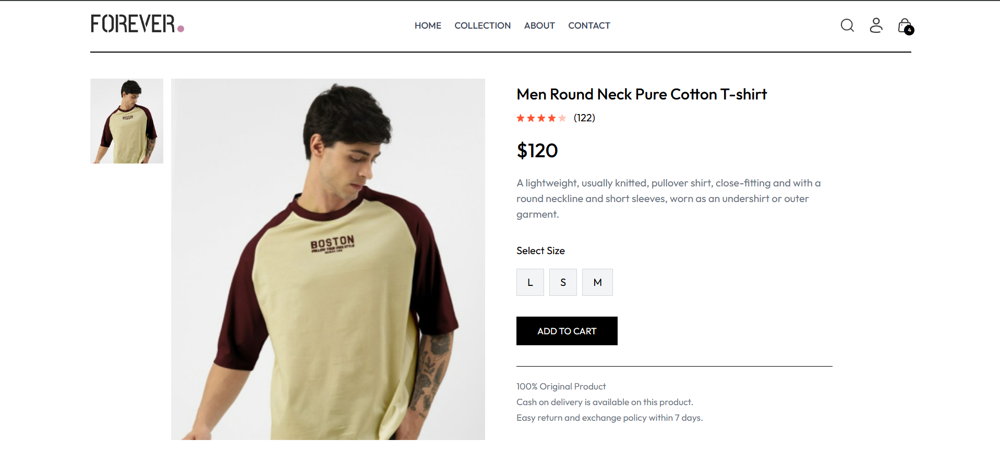
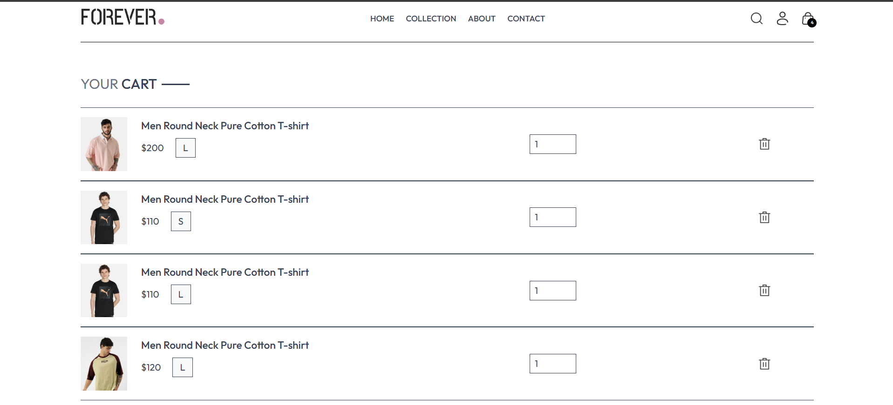
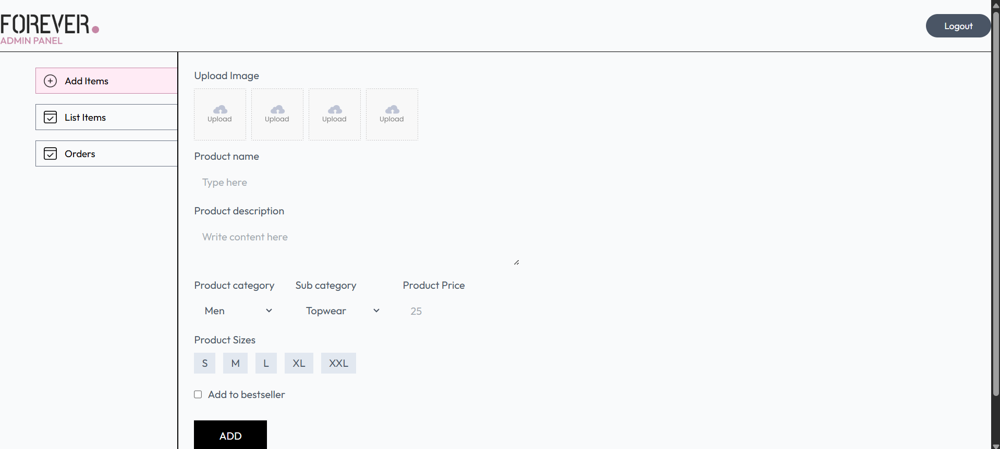

<div align="center">


<br/>

[](https://forever-frontend-jgifxgwlo-anurag-singhs-projects-f7753076.vercel.app)
[](https://github.com/ab6207/forever-full-stack)
[](LICENSE)


</div>

---

## 📖 Overview

**Forever Fashion** is a production-ready, full-stack e-commerce platform built with the **MERN Stack**. It delivers a complete online shopping experience — from browsing collections and managing carts to placing orders and processing secure payments.

A dedicated **Admin Dashboard** handles product management, order tracking, and inventory control — making it a fully operational end-to-end solution.

> Built to demonstrate real-world engineering: JWT auth, role-based access, Cloudinary media storage, Stripe payments, and scalable REST APIs — all deployed on Vercel.

---

## ✨ Features

<table>
<tr>
<td width="50%" valign="top">

### 👤 Customer Panel
- 🔐 User Registration & Secure Login
- 🛒 Add to Cart / Remove from Cart
- 🔍 Search & Filter Products by Category
- ❤️ Wishlist Management
- 📦 Place Orders with Address Management
- 💳 Secure Stripe Payments
- 📜 Order History & Tracking
- 📱 Fully Responsive UI

</td>
<td width="50%" valign="top">

### 👨‍💼 Admin Panel
- ➕ Add New Products with Images
- ✏️ Update / Edit Existing Products
- ❌ Delete Products
- 📦 Manage & Update Order Status
- 📊 Dashboard Overview
- 🖼️ Cloudinary Image Upload & Preview

</td>
</tr>
<tr>
<td valign="top">

### 🔒 Security
- 🔑 JWT-based Authentication
- 🛡️ Role-Based Route Authorization
- 🔐 Protected API Endpoints
- ✅ Input Validation & Error Handling

</td>
<td valign="top">

### ☁️ Cloud & Infra
- 📸 Cloudinary Image Uploads
- ⚡ Optimized Media Delivery (CDN)
- 🌐 Deployed on Vercel (Frontend + Admin)
- 🗄️ MongoDB Atlas (Cloud Database)

</td>
</tr>
</table>

---

## 🛠️ Tech Stack

| Layer | Technology |
|---|---|
| **Frontend** | React.js, Tailwind CSS, Axios, React Router |
| **Backend** | Node.js, Express.js |
| **Database** | MongoDB, Mongoose |
| **Authentication** | JSON Web Tokens (JWT) |
| **Payments** | Stripe |
| **Image Storage** | Cloudinary |
| **Deployment** | Vercel |

<div align="center">


</div>

---

## 📁 Project Structure

```
forever-full-stack/
│
├── 📂 backend/
│   ├── controllers/        # Route logic & business layer
│   ├── middleware/         # Auth middleware (JWT verify, admin check)
│   ├── models/             # Mongoose schemas (User, Product, Order)
│   ├── routes/             # API route definitions
│   └── server.js           # Express app entry point
│
├── 📂 frontend/
│   └── src/
│       ├── assets/         # Static images & icons
│       ├── components/     # Reusable UI components (Navbar, Footer, etc.)
│       ├── pages/          # Page views (Home, Product, Cart, Orders...)
│       └── context/        # React Context (Cart state, Auth state)
│
├── 📂 admin/
│   └── src/
│       ├── pages/          # Admin pages (Add Product, Orders, List)
│       ├── components/     # Admin UI components (Sidebar, Navbar)
│       └── assets/         # Admin static assets
│
├── 📂 screenshots/         # App preview images
└── README.md
```

---

## 🚀 Getting Started

### Prerequisites

Make sure you have the following set up before running the project:

```
Node.js >= 18
MongoDB Atlas account
Cloudinary account
Stripe account
```

### 1. Clone the Repository

```bash
git clone https://github.com/ab6207/forever-full-stack.git
cd forever-full-stack
```

### 2. Backend Setup

```bash
cd backend
npm install
```

Create a `.env` file in the `backend/` directory:

```env
PORT=4000
MONGODB_URI=your_mongodb_connection_string
JWT_SECRET=your_jwt_secret_key
CLOUDINARY_NAME=your_cloudinary_cloud_name
CLOUDINARY_API_KEY=your_cloudinary_api_key
CLOUDINARY_SECRET_KEY=your_cloudinary_api_secret
STRIPE_SECRET_KEY=your_stripe_secret_key
```

Start the backend server:

```bash
npm run server
```

### 3. Frontend Setup

```bash
cd frontend
npm install
npm run dev
```

### 4. Admin Panel Setup

```bash
cd admin
npm install
npm run dev
```

> The frontend runs on `http://localhost:5173` and the backend on `http://localhost:4000` by default.

---

## 🔗 API Reference

### 🔐 Authentication

| Method | Endpoint | Description |
|--------|----------|-------------|
| `POST` | `/api/user/register` | Register a new user |
| `POST` | `/api/user/login` | Login and receive JWT token |
| `POST` | `/api/user/admin` | Admin login |

### 🛍️ Products

| Method | Endpoint | Access | Description |
|--------|----------|--------|-------------|
| `GET` | `/api/product/list` | Public | Get all products |
| `GET` | `/api/product/single` | Public | Get single product by ID |
| `POST` | `/api/product/add` | Admin | Add a new product |
| `POST` | `/api/product/remove` | Admin | Remove a product |

### 📦 Orders

| Method | Endpoint | Access | Description |
|--------|----------|--------|-------------|
| `POST` | `/api/order/place` | User | Place a COD order |
| `POST` | `/api/order/stripe` | User | Place a Stripe payment order |
| `GET` | `/api/order/userorders` | User | Get orders for logged-in user |
| `GET` | `/api/order/list` | Admin | Get all orders |
| `POST` | `/api/order/status` | Admin | Update order delivery status |

### 🛒 Cart

| Method | Endpoint | Access | Description |
|--------|----------|--------|-------------|
| `POST` | `/api/cart/add` | User | Add item to cart |
| `POST` | `/api/cart/update` | User | Update cart item quantity |
| `POST` | `/api/cart/get` | User | Get user cart data |

---

## 📸 Application Preview

### 🏠 Home Page
<p align="center">
  
</p>

### 📦 Product Page
<p align="center">
  
</p>

### 🛒 Cart Page
<p align="center">
  
</p>

### 👨‍💼 Admin Dashboard
<p align="center">
  
</p>

---

## 🌐 Live Demo

> 🔗 **[https://forever-frontend-jgifxgwlo-anurag-singhs-projects-f7753076.vercel.app](https://forever-frontend-jgifxgwlo-anurag-singhs-projects-f7753076.vercel.app)**

---

## 👨‍💻 Author

<div align="center">

**Anurag Singh**

🎓 B.Tech CSE (2027) — IIIT Bhopal &nbsp;|&nbsp; 💻 MERN Stack Developer &nbsp;|&nbsp; 🧩 DSA Enthusiast

[](https://github.com/ab6207)

🚀 *Open to SDE & Full Stack Opportunities*

</div>

---

⭐ **If this project helped you, please consider giving it a star!**


</div>
